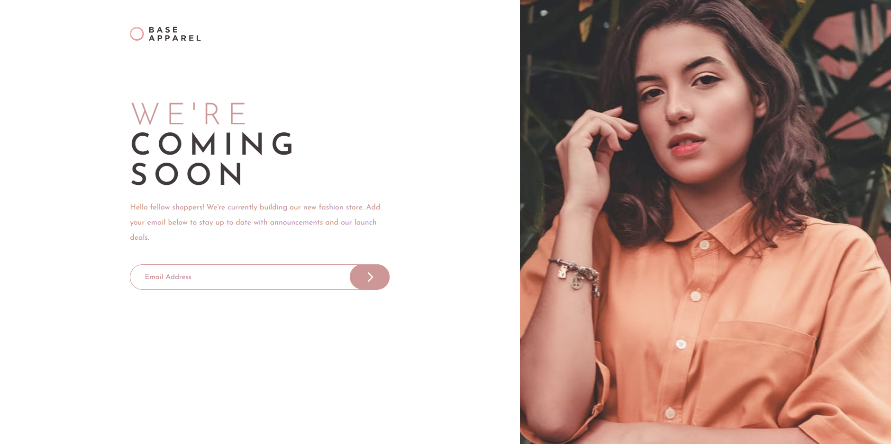

# Frontend Mentor - Base Apparel coming soon page solution

This is a solution to the [Base Apparel coming soon page challenge on Frontend Mentor](https://www.frontendmentor.io/challenges/base-apparel-coming-soon-page-5d46b47f8db8a7063f9331a0). Frontend Mentor challenges help you improve your coding skills by building realistic projects.

## Table of contents

- [Overview](#overview)
  - [The challenge](#the-challenge)
  - [Screenshot](#screenshot)
  - [Links](#links)
- [My process](#my-process)
  - [Built with](#built-with)
  - [What I learned](#what-i-learned)
  - [Useful resources](#useful-resources)
- [Author](#author)
- [Acknowledgments](#acknowledgments)

## Overview

### The challenge

Users should be able to:

- View the optimal layout for the site depending on their device's screen size
- See hover states for all interactive elements on the page
- Receive an error message when the `form` is submitted if:
  - The `input` field is empty
  - The email address is not formatted correctly

### Screenshot

### Links

- Solution URL: [Website](https://www.frontendmentor.io/solutions/responsive-product-preview-card-component-4aXQB8D2cj)
- Live Site URL: [Website](https://lost50u1.github.io/product-preview-card-component-main/)

## My process

### Built with

- Semantic HTML5 markup
- CSS custom properties
- Mobile-first workflow
- CSS grid
- CSS flexbox
- JS

### What I learned

- I learned more about websites layout.
- I learned to use js to make the form validation work.
- I learned more css styles on forms.
- I learned on how to use google material fonts.

### Useful resources

- [How TO - Change Placeholder Color](https://www.w3schools.com/howto/howto_css_placeholder.asp) - This helped to change the placeholder text color.
- [JavaScript: HTML Form - email validation](https://www.w3resource.com/javascript/form/email-validation.php) - This helped me for the form validation.
- [How to change border color of textarea on :focus](https://stackoverflow.com/questions/16156594/how-to-change-border-color-of-textarea-on-focus) - This helped to change the placeholder active state color.

## Author

- Website - [Biruk Moges](https://lost50u1.github.io/)
- Frontend Mentor - [@lost50U1](https://www.frontendmentor.io/profile/lost50U1)
- Twitter - [@cc64e15cb0f543a](https://www.twitter.com/@cc64e15cb0f543a)

## Acknowledgments

I used https://www.freecodecamp.org website as a guide to do the project and it have many useful tutorials i used for this project.
